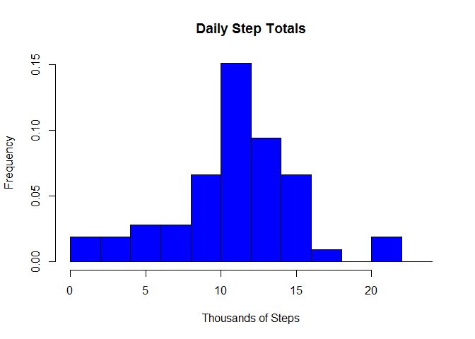

# Reproducible Research: Peer Assessment 1

PAI_template.Rmd
Project for the Coursera Reproducible Research Class

The purpose of this project is to provide a reproducible data analysis using
the knitr R package. The project analyzes the steps data taken from a personal
activity monitor at 5 minute intervals in October and November of 2012. 

RAW DATA:
The raw data consists of approxiamtely 17,568 data records of steps taken. Each
record contains three fields:

Column-1: steps
Column-2: date
Column-3: interval - This column indicates the total number of elapsed minutes
          in an indirect way. After every hour or 60 minutes, 40 minutes are
          added so that the minute count changes to 100 instead of 60, 200 after
          2-hours, 300 after three hours and so on until the count is 2355 at
          the end of a day. The next interval reset the count to 0. Although
          this not a time interval in the usual sense, we also call this
          variable "interval" in order to match the raw data.
          
## Loading and preprocessing the steps taken data


```r
file_name <- "activity.csv"

df_steps <-read.csv("activity.csv")

colnames(df_steps) <- c("steps","date","interval")
```


## What is mean total number of steps taken per day?


```r
days <- unique(df_steps[,2])
           
   ##   Form the subsets of the test data for each day
   ##     for(i in seq_along(unique_days)){
   ##             day_data[i] <- df_steps[df_steps[,"date"]==days[i],]
   ##    }
day_sums <- tapply(df_steps[,1],df_steps[,2],sum) / 1000
```


```r
hist(day_sums,breaks=c(0,2,4,6,8,10,12,14,16,18,20,22,24))
```

 


## What is the average daily activity pattern?


## Imputing missing values


## Are there differences in activity patterns between weekdays and weekends?
